 

**I ship AI products, cross-platform apps, and the quantitative systems most engineers won't touch.**
End to end, tested, handed off clean.

 

---

## What I build for you

| ◈ &nbsp;AI Products & Automation | ▤ &nbsp;Apps & Platforms | ∿ &nbsp;Quantitative Systems 🔒 |
|:---|:---|:---|
| Multi-tenant SaaS, agentic pipelines, and scraping systems that run themselves — from LLM integration to human-in-the-loop approval. | Offline-first Flutter apps and fullstack monorepos, from empty repo to store-ready. Clean architecture, real test coverage. | The deep end: HFT infrastructure, Kalman & Ornstein–Uhlenbeck estimation, empirical-Kelly risk governors, sub-ms pipelines. |
| [`afie`](https://github.com/rakibulmehedi/afie) · [`adcraft`](https://github.com/rakibulmehedi/adcraft) · [`telegraft`](https://github.com/rakibulmehedi/telegraft) | [`Helm`](https://github.com/rakibulmehedi/Helm) · [`NeonVegas`](https://github.com/rakibulmehedi/NeonVegas) | `quantis` · `APEX` *(private)* |

---

## Selected work

> **Flagships**

**[afie](https://github.com/rakibulmehedi/afie)** &nbsp;·&nbsp; 
Autonomous Founder Identity Engine — a multi-tenant AI platform that synthesizes, approves, and distributes founder content at institutional quality. Saga-pattern orchestration, human-in-the-loop gating.
`Python` · `FastAPI` · `Next.js` · `PostgreSQL`

**[Helm](https://github.com/rakibulmehedi/Helm)** &nbsp;·&nbsp; 
Flutter finance app for freelancers with unstable income — know exactly what's safe to spend, not just your balance. Offline-first, clean architecture, built to ship.
`Dart` · `Flutter` · `Riverpod` · `Hive`

> **Also worth a look**

| Project | What it is | Stack |
|:---|:---|:---|
| [**adcraft**](https://github.com/rakibulmehedi/adcraft) | AI ad-copy generator across 6 platforms, packaged as a SaaS | `Python` `LangChain` `FastAPI` |
| [**telegraft**](https://github.com/rakibulmehedi/telegraft) | Production Telegram content pipeline — scrape, curate, republish | `Python` `asyncio` `Docker` |
| [**NeonVegas**](https://github.com/rakibulmehedi/NeonVegas) | Flutter + NestJS fullstack monorepo, end-to-end typed | `Dart` `NestJS` `Prisma` |
| [**ou_estimator**](https://github.com/rakibulmehedi/ou_estimator) | Ornstein–Uhlenbeck parameter estimator (OLS / exact MLE) | `Dart` `Flutter` |

---

## 🔒 Institutional work — private

Source available under NDA · live walkthrough on a call · redacted public showcase in progress.

> **quantis** — Regime-aware alpha engines · empirical-Kelly sizing · 8-gate risk governor · Ed25519 kill-switches · sub-millisecond ZMQ pipeline. **1120+ tests.**
>
> **APEX** — Hybrid C++20 / Python HFT infrastructure · Kalman-filter & Ornstein–Uhlenbeck state estimation · Modified-Kelly & VaR risk management.

---

## Stack

Also: C++20 · ZeroMQ · LangChain · Prisma · Hive · Pydantic · pytest

---

## Let's build something

Have a project worth building? I reply within 24h.

